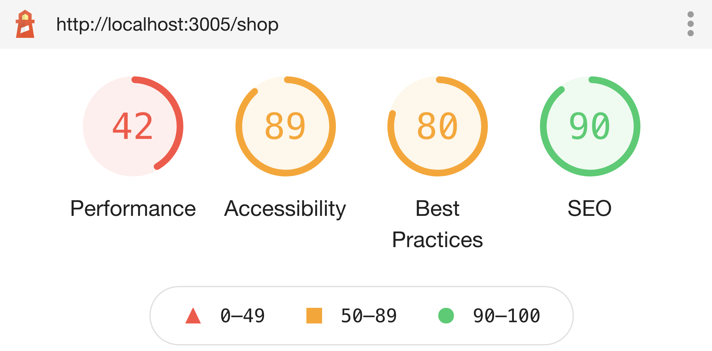

# Web Store 

A web store application built using React JS.

## Status

### Deployment
[](https://app.netlify.com/sites/ecomm-site/deploys)

### Lighthouse




## Testing

1. Install the project dependencies
   ```shell
   npm install
   ```

2. Run the application
   ```shell
   npm run start
   ```

## Demo

<iframe width="560" height="315" src="https://www.youtube.com/embed/A2jBeqMTFCs" title="YouTube video player" frameborder="0" allow="accelerometer; autoplay; clipboard-write; encrypted-media; gyroscope; picture-in-picture" allowfullscreen></iframe>